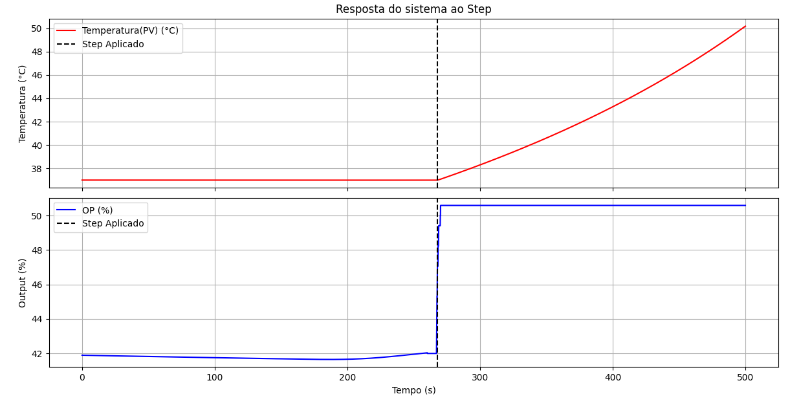
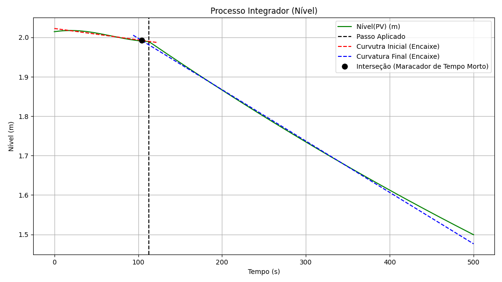
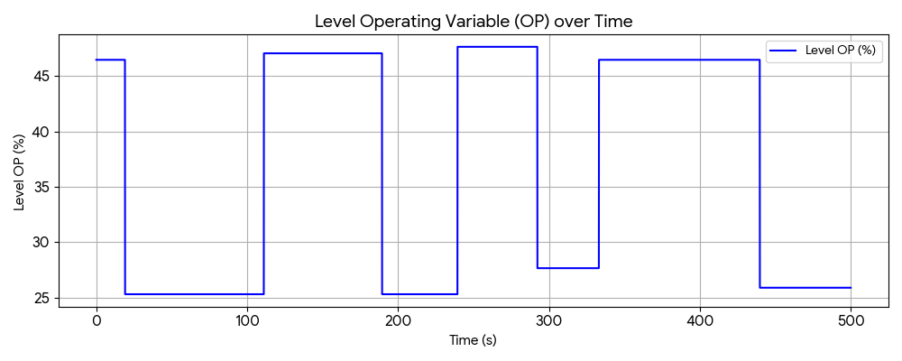
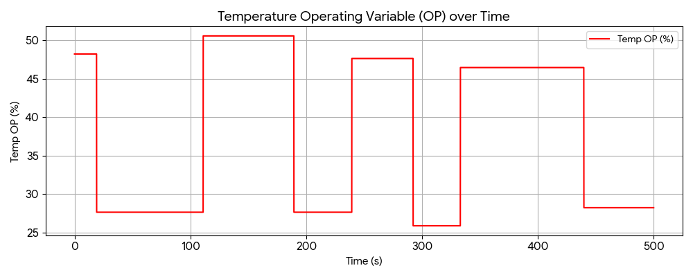
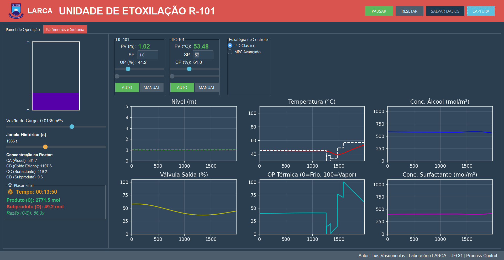
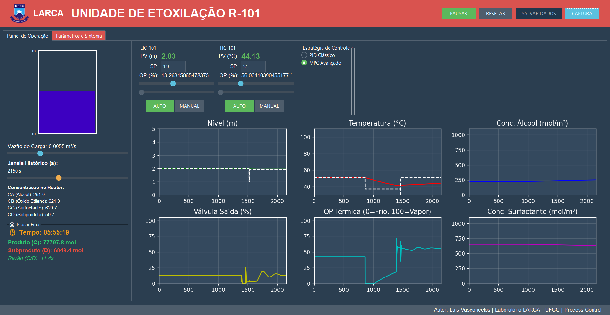
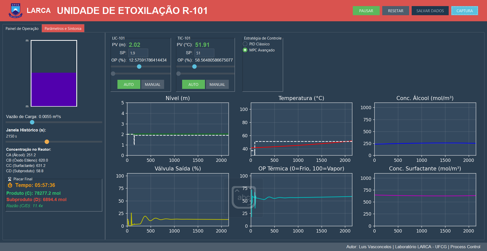

# Atividade Controle Avançado (período 26.1)

Repositório para disciplina Controle Avançado de Processos no Programa de Pós-Graduação em Engenharia Quimica
### Autores: Ian Ferreira e Maria Eduarda Cunha

## Cenário:
Controle de Nível e Temperatura de um CSTR com Atraso através de controladores PID e MPC

## Sumário

- [Reconhecimento de Sistema](#reconhecimento-de-sistema)
  - [Temperatura](#temperatura)
  - [Nível](#nível)
  - [PRBS](#prbs)
- [Função de Transferência](#função-de-transferência)
- [Controle PID](#controle-pid)
- [Controlador MPC](#controle-mpc)
- [Interpretação de Resultados](#interpretação-de-resultados)
- [Referências](#referências)
  
---
### Reconhecimento de Sistema:
Foi inicialmente causado pertubações no sistema em malha aberta para poder avaliar o comportamento que este assumia. Foram dados sinais do tipo "Step" nas variáveis manipuladas de interesse. Assim podendo fazer o reconhecimento e encontrar os parâmetros das [Funções de Transferêcia](#função-de-transferência). 
  
  ### Temperatura

  O gráfico abaixo apresenta a resposta da variável de processo após uma pertubação do tipo _Step_ na variável manipulada. Foi feito um processo de limpeza dos ruídos nos resultados, utilizando efetivamente a resposta após o _Step_ para reconhecimento do sistema. O reconhecimento do sistema foi feito através de metódos análitcos, como descritos por _Skogestad, 2003_

   
  

  
  ### Nível

  O gráfico abaixo apresenta a resposta da variável de processo após uma pertubação do tipo _Step_ na variável manipulada. Foi feito um processo de limpeza dos ruídos nos resultados, utilizando efetivamente a resposta após o _Step_ para reconhecimento do sistema. O reconhecimento do sistema foi feito através de sistemas de identificação built-in **IDENT**, parte do pacote MATLAB. 
  
  

  ### PRBS

  Sinais aleatórios para cálculo e identificação dos sub-espaços do sistema (Que foram posteriormente usados na Aplicação do controlador MPC)

  
  
  
  
  
---
### Função de Transferência: 

Função de Transferência de Nível, devido a resposta do sistema e através do declive apresentado, se assemelha com Comportamento de Processo Integrador: 

$$
G(s) = \frac{K}{s}
$$

Função de Transferência da Temperatura teve melhor encaixe com comportamento de Processo de Primeira Ordem com Tempo Morto: 

$$
G(s) = \frac{K}{{τ_i}s + 1}e^{-{τ_d}s}
$$

---

### Controle PID

Dois controladores PID operam as malhas de nível e temperatura:

- **LIC-101 (Nível)**: $K_p = -60$ (ação reversa: nível alto $\rightarrow$ saída diminui $\rightarrow$ válvula fecha)
- **TIC-101 (Temperatura)**: $K_p = 3.39$ (ação direta: temperatura alta $\rightarrow$ saída aumenta $\rightarrow$ resfria)

A equação do controlador na forma paralela:

$$u(t) = K_p \cdot e(t) + K_i \int_0^t e(\tau) d\tau + K_d \frac{de(t)}{dt}$$

com $e(t) = SP - PV$ (erro = setpoint $-$ processo).

Para encontrar os parâmetros foi utilizado o metódo de IMC como descrito por _Skogestad 2003_. 

$$
Kp = \frac{1}{k'}\frac{τ}{τ_c + θ}
$$

$$
τ_i = τ_i
$$

$$
τ_d = τ_d
$$

Neste caso, como o sistema se trata de processos do tipo Integrador e de 1ª ordem apenas, $τ_d = 0$.

### Resposta PID:

Através dos resultados é possível perceber uma resposta mais rápida do sistema a desvios bruscos, abrindo e fechando as válvulas respeitando os limites físicos do sistema, no entanto, as abrindo e fechando de forma rápida para corrigir o desvio do Setpoint em um espaçp de tempo pequeno, porém, suavizando a correção cada vez mais ao se aproximar do Setpoint determinado, deixando a ação do controle mais lenta. No longo prazo, os resultados mostram uma possibilidade de falhas no sistema mecânico das válvulas, necessitando de mais lubrificação e manutenções mais constantes do equipamento, devido a ação do controlador. 

---
### Controle MPC:
A aplicação foi feito como um controlador do tipo Múltiplos Inputs, Múltiplos Outputs (*MIMO*), devido ao forte acomplamento das variáveis observadas. Deste modo, os seguintes passos são realizados para melhor compreensão da aplicação.

  ### Reconhecimento de Sub-Espaços
  Para encontrar os Paramêtros que o sistema irá utilizar para cálculo de ajuste, utiliza-se o resultados obtidos durantes os testes na seção [_PRBS_](#prbs). Posteriomente, utiliza-se o metódo de reconheciemnto de Sub-Espaços *N4SID* para obter as matrizes que irão reger o sistema, com as equações apresentadas abaixo. 
  
  $$
  x_{k+1} = A x_k + B u_k \qquad 
  y_k = C x_k 
  $$

  ### Aplicação
  Utilizando-se dos resultados encontrado para as matrizes, foi feita a aplicação gerando a classe [CSTR_MPC](App_CSTR_Resolut/CSTR_MPC.py). Para a inicialização do Obejto no arquivo [main_copy.py](App_CSTR_Resolut/main_copy.py) (arquivo principal para execução do App_CSTR) é necessário a escolha de um `passo`, um `horizonte de predição` e um `horizonte de controle`, respectivamente. Normalmente, emprega-se um *Horizonte de Controle* proporcionalmente menor que o Horizonte de Predição devido ao esforço computacional necessário para os cálculos do MPC, quanto maior o *Horizonte de Controle* maior será o consumo de memória ram da máquina. 
  A função custo associada a penalização do sistema é a dada pela função descrita abaixo: 

  $$ 
  J = \sum_{i=1}^{N_p} |y_{k+i} - r_{k+i}|Q^2 + \sum_{j=0}^{N_c-1} |u_{k+j}|R^2 + \sum_{j=1}^{N_c-1} |\Delta u_{k+j}|_{R_u}^2 
  $$

Foram colocadas restrições para o sistema, respeitando os limites físicos das válvulas - representados em porcentagens, com variações de 0% a 100% -, fazendo parte do cálculo do otimizador utilizado no método _update_ em _CSTR_MPC.py_. 

Na tela do supervisório é possível notar uma caixa com botões de opção para variar entre a ataução do controle PID ou controle MPC.

  ### Resposta MPC

  É perceptível que a resposta do controlador performa melhor onde os resultados das matrizes dos sub-espaços foram identificadas, dando um melhor resultado dentro dessa faixa de atuação. O controlador tem uma atuação mais lenta que a do PID, resolvendo de forma gradual o desvio da váriavel do processo com o Setpoint do sistema. 
  

Resultando em uma resposta mais suave de controle, mas, com uma demora maior de estabilização do sistema, o que pode apresentar um risco em sistemas de dinâmica mais sensível que precisam de resposta mais rápida de correção. É necessário ressaltar também a perda de rendimento de produção devido a resposta lenta do atuador, gerando muito subproduto devido as flutuaçõs de temperatura e carga. 

---
### Interpretação de Resultados

Ambos os sistemas se apresentam como boas alternativas e estratégias de controle bem sucedidas em suas propostas de atuação, com um melhor desempenho de estabilidade do controle PID e com uma dinâmica de atuação mais cautelosa por parte do MPC. Para correções mais rápidas e com mais desvios a ação do controlador PID é mais rápida e brusca, fazendo o sistema ter uma correção mais rápida, enquanto o controlador MPC se apresenta como uma alternativa quando o sistema precisa de uma resposta mais lenta de atuação e mais segura. 

---
 ## Referências

1. Fogler, H. S. (2016). *Elements of Chemical Reaction Engineering* (5th ed.). Prentice Hall.
2. Seborg, D. E., Edgar, T. F., Mellichamp, D. A., & Doyle, F. J. (2016). *Process Dynamics and Control* (4th ed.). Wiley.
3. Skogestad, Sigurd. *Simple Analytic Rules for Model Reduction and PID Controller Tuning. Journal of Process Control*, v. 13, n. 4, p. 291-309, 2003.
4. Smith, J. M., Van Ness, H. C., & Abbott, M. M. (2005). *Introduction to Chemical Engineering Thermodynamics* (7th ed.). McGraw-Hill.
5. Marlin, T. E. (2000). *Process Control: Designing Processes and Control Systems for Dynamic Performance* (2nd ed.). McGraw-Hill.
6. Luyben, W. L. (1990). *Process Modeling, Simulation, and Control for Chemical Engineers* (2nd ed.). McGraw-Hill.

---
